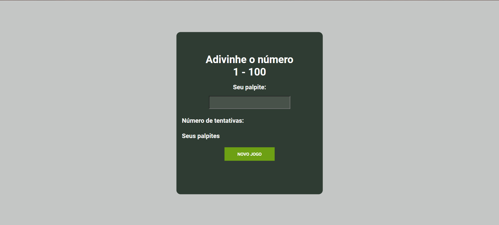
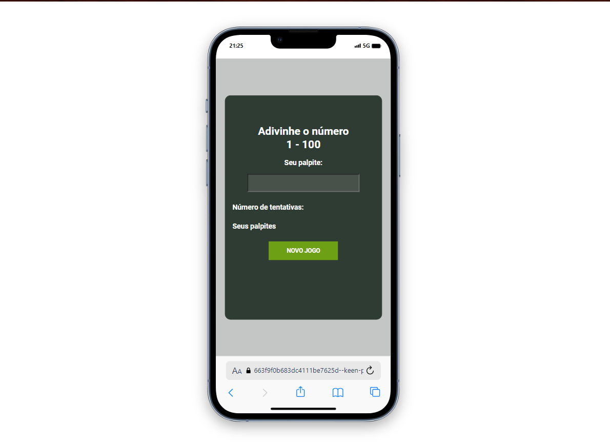

# 📋 Indíce

- [Bem-vindo](#id01)
- [Proposta](#id02)
- [Desafio](#id03)
- [Aprendizado](#id04)
- [Prosseguimento](id05)
- [Screenshots](#id06)
- [Links](#id07)
- [Tecnologias utilizadas](#id08)
- [Pré-requisitos](#id09)
- [Procedimentos de instalação](#id010)
- [Informações](#id011)

# Bem-vindo! 👋 <a name="id01"></a>

**Botão Cromático**
<br />

## 🚀 Proposta <a name="id02"></a>

O Enigma Numérico é um projeto de jogo simples desenvolvido com o objetivo de desafiar os jogadores a adivinharem um número aleatório dentro de um intervalo predefinido, utilizando apenas 7 tentativas. O jogo foi concebido para oferecer uma experiência interativa e divertida, enquanto promove o desenvolvimento das habilidades de lógica e raciocínio dos jogadores.
<br />

## :trophy: Desafio <a name="#id03"></a>

Um dos principais desafios foi o gerenciamento de tentativas. Definir e controlar o número máximo de tentativas permitidas pelos jogadores, mantendo a jogabilidade equilibrada e desafiadora, exigiu uma abordagem cuidadosa e uma compreensão profunda da lógica do jogo.

## :trophy: Aprendizado <a name="#id04"></a>

#### Construído com:

- Lógica de Programação: O projeto proporcionou uma oportunidade para aprimorar habilidades de resolução de problemas e desenvolver uma compreensão mais profunda dos conceitos de lógica de programação.

- Interatividade do Usuário: Incorporar elementos interativos para permitir que os usuários inserissem seus palpites e recebessem feedback imediato contribuiu para uma compreensão mais ampla da interação entre o JavaScript e o HTML.

## :trophy: Prosseguimento <a name="id05"></a>

- Realizar projetos utilizando o React.js

# :camera_flash: Screenshots <a name="id06"></a>

## :video_camera: Video


## :desktop_computer: Desktop design



## :iphone: Mobile design



<br />

# :heavy_check_mark: Links <a name="id07"></a>

<br />

- Para acessar o site [Clique aqui](https://663f9f0b683dc4111be7625d--keen-pithivier-a97690.netlify.app/)

<br />

# 🛠 Tecnologias utilizadas <a name="id08"></a>

<br />

- HTML: Utilizado para estruturar a interface do jogo e fornecer elementos interativos para os usuários.

- SASS (CSS Pré-processado): Utilizado para estilizar a interface do jogo de forma modular e eficiente.

JavaScript: Utilizado para implementar a lógica do jogo, incluindo a geração de números aleatórios, o gerenciamento de tentativas e a validação da entrada do usuário.

- GIT: Utilizado para controle de versão do código-fonte.
  <br />

# ☑️ Pré-requisitos <a name="id09"></a>

<br />

- [x] Editor de código de sua preferência (recomendado VS code)
- [x] Git

<br />

# 📝 Procedimentos de instalação <a name="id010"></a>

<br />

Clone este repositório usando o comando:

```bash
git clone https://github.com/RaizaCirne/enigma-numerico.git
```

Baixar arquivo zip

Extrir arquivos

Abrir pasta no editor de código.

<br />

# :sunglasses: Informações <a name="id011"></a>

<br />

- Personal Page - [Raíza Cirne Braz](https://663f9f0b683dc4111be7625d--keen-pithivier-a97690.netlify.app/)
- Frontend Mentor - [@RaizaCirne](https://www.frontendmentor.io/profile/RaizaCirne)
- GitHub - [RaizaCirne](https://github.com/RaizaCirne)
- LinkedIn - [Raíza Cirne Braz](https://www.linkedin.com/in/ra%C3%ADzacirne/)

**JavaScript - GIT - SASS - CSS3 - HTML5** 🚀
